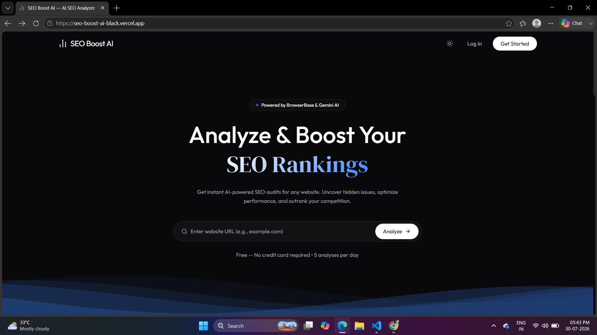
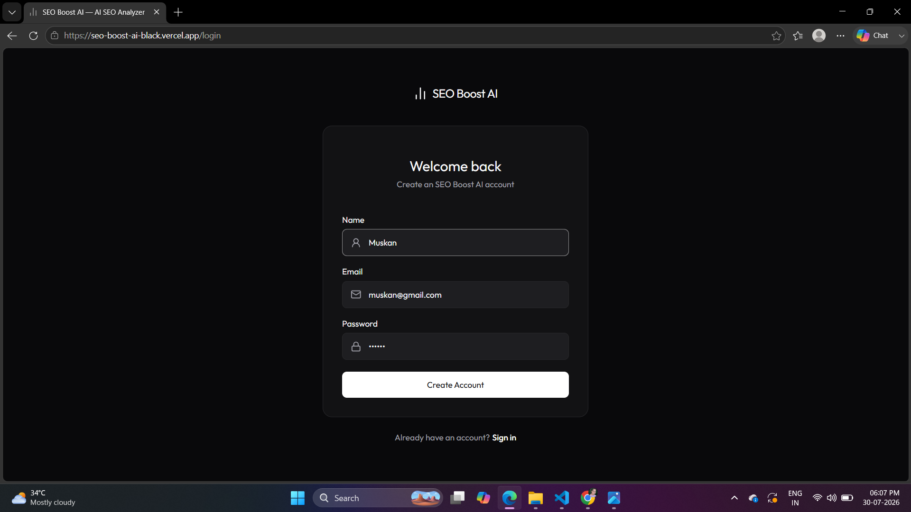
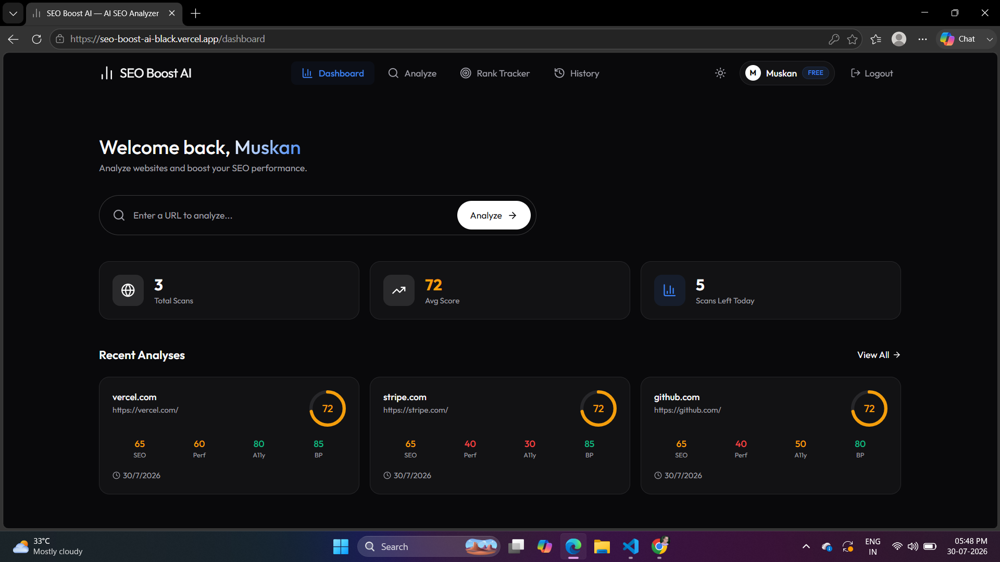
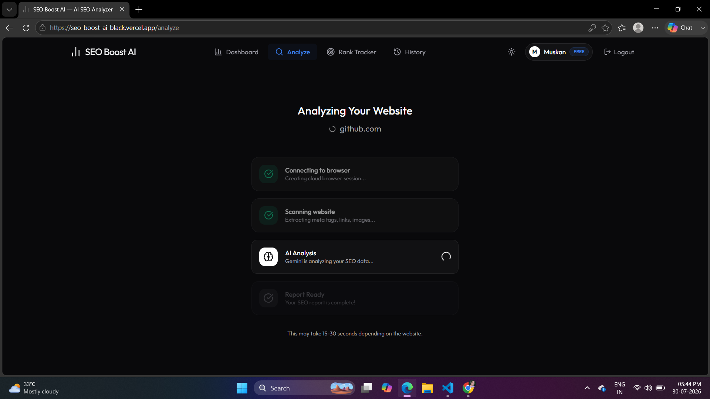
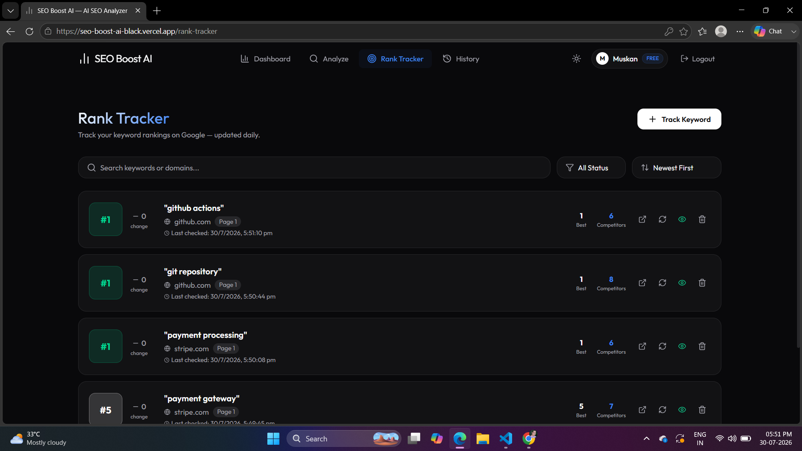

# 🚀 SEO Boost AI

SEO Boost AI is a full-stack AI-powered SEO analysis platform that helps users analyze websites, track keyword rankings, and generate SEO insights using Google Gemini AI.

---

## 📸 Project Preview



---

## ✨ Features

- 🔐 User Authentication (JWT)
- 🌐 Website SEO Analysis
- 🤖 AI-powered SEO Report (Google Gemini)
- 📈 Keyword Rank Tracking
- 📊 Dashboard with Analysis History
- 🖼️ Meta Tags Analysis
- 🔗 Internal & External Link Analysis
- 📝 Heading Structure Analysis
- 🖼️ Image Alt Text Analysis
- ⚡ Performance Metrics
- 📱 Responsive UI

---

## 🖼️ Screenshots

### 🔑 Login



### 📊 Dashboard



### 🔍 Website Analysis




### 📈 Rank Tracker




---

## 🛠️ Tech Stack

### Frontend

- React
- TypeScript
- Vite
- Tailwind CSS
- Axios
- React Router
- Lucide React

### Backend

- Node.js
- Express.js
- MongoDB
- Mongoose
- JWT Authentication
- Playwright
- Google Gemini AI
- SerpAPI
- Node Cron

---

## 📂 Project Structure

```
SEOBoost-AI/
│
├── client/
│   ├── src/
│   ├── public/
│   └── package.json
│
├── server/
│   ├── config/
│   ├── controllers/
│   ├── middleware/
│   ├── models/
│   ├── routes/
│   ├── services/
│   ├── cron/
│   ├── server.js
│   └── package.json
│
└── README.md
```

---

## ⚙️ Environment Variables

### Server (.env)

```env
PORT=5000

JWT_SECRET=your_jwt_secret

MONGODB_URI=your_mongodb_connection_string

GEMINI_API_KEY=your_gemini_api_key

SERPAPI_KEY=your_serpapi_key
```

### Client (.env)

```env
VITE_BACKEND_URL=http://localhost:5000
```

---

## 🚀 Installation

### Clone Repository

```bash
git clone https://github.com/yourusername/SEOBoost-AI.git
```

### Install Frontend

```bash
cd client
npm install
npm run dev
```

### Install Backend

```bash
cd server
npm install
npm run server
```

---

## 🚀 Deployment

### Frontend
- Vercel

### Backend
- Render

---

## 📸 Features

- Login & Registration
- AI SEO Analysis
- Keyword Tracking
- SEO Score
- Meta Data Report
- Heading Analysis
- Image SEO
- Internal & External Links
- Dashboard
- Analysis History

---

## 👨‍💻 Author

**Muskan Tuteja**

GitHub: https://github.com/Muskan-tuteja

LinkedIn: https://www.linkedin.com/in/muskan-tuteja-90b1b2322

---

## ⭐ If you like this project

Give it a ⭐ on GitHub.